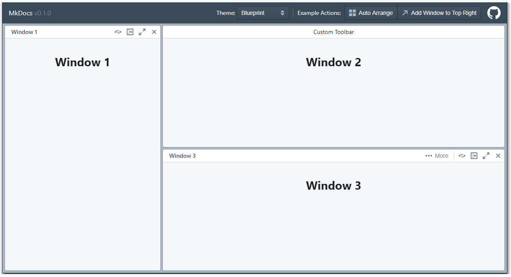

## react-mosaic-cra

This project is an re-implementation, in JavaScript, of the [react-mosaic](https://github.com/nomcopter/react-mosaic) demo
application.

The following changes have been made:

* Typescript demo source converted to JavaScript
* CSS converted from LESS to SASS
* The react-mosaic custom webpack build changed to vanilla create-react-app v3.4.1

**Usage**

        npm install
        npm start

Visit [http://localhost:1234/](http://localhost:1234/)